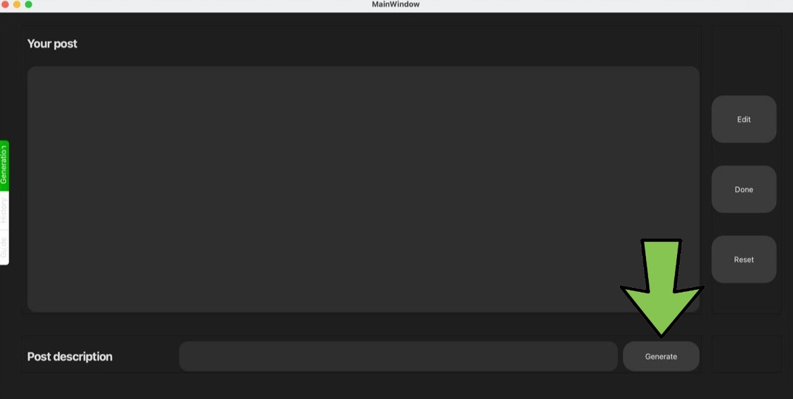

## Шаг 1 
Добавьте нашего бота в ваш канал: [@ai_app_1_bot](https://t.me/ai_app_1_bot).

    

## Шаг 2
Отправьте сообщение боту [@LeadConverterToolkitBot](https://t.me/LeadConverterToolkitBot) и укажите ваш channel id (ID вашего Telegram-канала).

    

## Шаг 3
Зарегестрируйтесь, используя Id из прошлого шага

    

## Шаг 4
На главной странице введите название вашего поста и нажмите кнопку \"Generate\".  
Yandex GPT сгенерирует для вас текст.

    

## Шаг 5
Используйте кнопки \"Reset\" для очистки текста или \"Generate\" для перегенерации нового варианта.

    

## Шаг 6
Нажмите кнопку \"Edit\", _зарегистрируйтесь в **Strapi**_* (если еще не сделали этого), войдите в проект \"Blogs\" и отформатируйте, отредактируйте пост. Сохраните изменения и опубликуйте пост в Strapi.

    

*При регистрации в Strapi указывайте те же данные что и в **шаге 3**

## Шаг 7
Вернитесь в приложение AI APP и нажмите кнопку \"Done\": бот отправит ваш пост в ваш канал.

    

## Шаг 8
Посмотреть историю ваших постов можно в Strapi или на специальной странице \"History\".

    

## Шаг 9
Нажмите на название поста справа, и слева отобразится предыдущий пост.

    

## Готово! Наслаждайтесь созданием контента с помощью AI APP!
